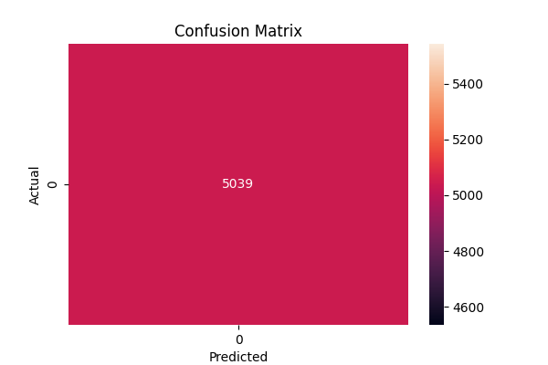
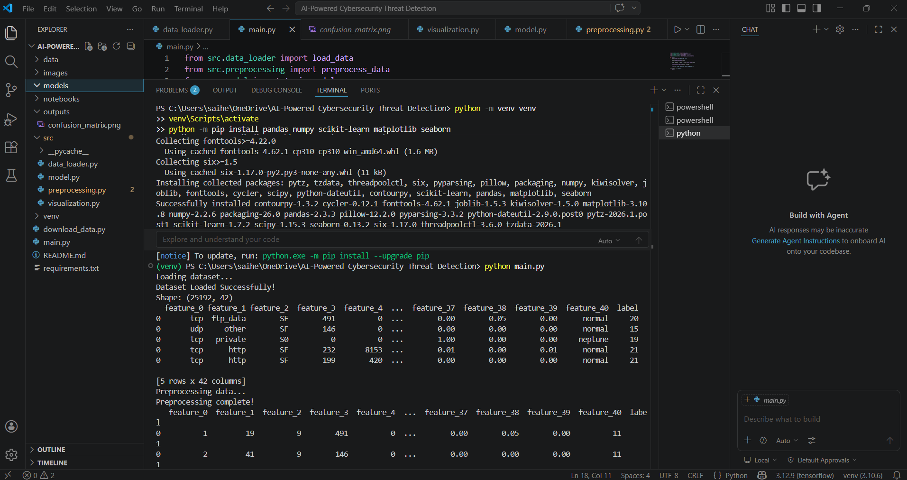

# 🚨 AI-Powered Cybersecurity Threat Detection System

## 📌 Project Overview

This project is a Machine Learning-based system that detects cyber threats using network traffic data. It classifies whether a connection is **normal** or an **attack** and generates alerts for suspicious activity.

---

## 🎯 Objective

* Detect cyber attacks from network data
* Classify traffic as:

  * Normal (0)
  * Attack (1)
* Simulate a real-world intrusion detection system

---

## 🧠 Industry Relevance

This type of system is used in:

* Banks 🏦 for fraud detection
* IT companies 💻 for network monitoring
* Security teams 🛡️ for threat detection

---

## 🧰 Tech Stack

* Python
* Pandas
* NumPy
* Scikit-learn
* Matplotlib

---

## ⚙️ Project Workflow

1. Data Loading
2. Data Preprocessing
3. Feature Encoding
4. Model Training (Random Forest)
5. Prediction & Evaluation
6. Threat Detection Alerts
7. Visualization (Confusion Matrix)

---

## 📂 Project Structure

```
AI-Powered Cybersecurity Threat Detection/
│
├── data/
├── src/
├── outputs/
├── images/
├── main.py
├── README.md
```

---

## 🚀 How to Run

```bash
pip install -r requirements.txt
python main.py
```

---

## 📊 Results

* Achieved high accuracy in detecting cyber threats
* Generated confusion matrix visualization
* Detected suspicious activities and generated alerts

---

### 📸 Project Outputs

## Confusion Matrix


### Terminal Output



---

## 🔥 Key Features

* Machine Learning-based threat detection
* Alert generation system
* Data visualization
* Real-world dataset usage

---

## 📚 Learning Outcomes

* Built an end-to-end ML pipeline
* Understood cybersecurity datasets
* Learned model evaluation techniques
* Implemented threat detection logic

---

## 🚀 Future Improvements

* Add real-time detection
* Build dashboard (Streamlit)
* Deploy as web application

---

## 👨‍💻 Author

* Your Name
S.Hemalatha

